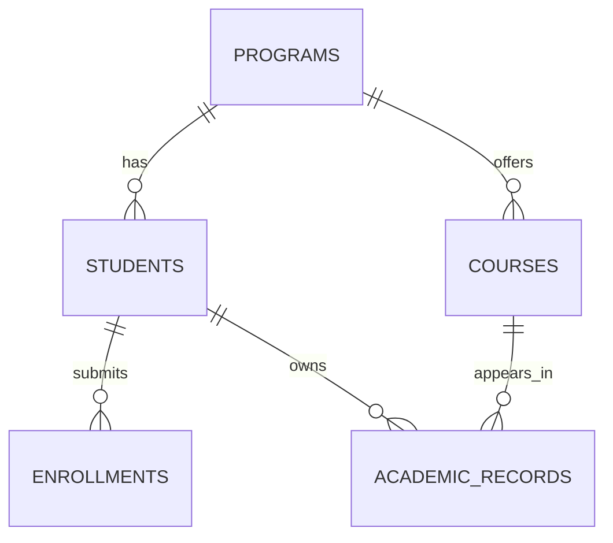

# RegistrarSys — Data Model

## 1. Overview

RegistrarSys manages five main data entities:

- Students
- Programs
- Courses
- Enrollments
- Academic Records

For the SIA midterm, the system uses in-memory mock data stored in `server/data/mockData.js`. No database connection is required.

## 2. Entity Relationship Diagram

## 3. Entity Fields

### Programs

| Field | Type |
|---|---|
| id | Integer |
| code | String |
| name | String |

### Students

| Field | Type |
|---|---|
| id | Integer |
| studentNumber | String |
| firstName | String |
| lastName | String |
| program | String |
| yearLevel | Integer |
| status | String |

### Courses

| Field | Type |
|---|---|
| id | Integer |
| code | String |
| title | String |
| program | String |
| units | Integer |
| yearLevel | Integer |

### Enrollments

| Field | Type |
|---|---|
| id | Integer |
| studentId | Integer |
| academicYear | String |
| semester | String |
| status | String |

### Academic Records

| Field | Type |
|---|---|
| id | Integer |
| studentId | Integer |
| courseId | Integer |
| academicYear | String |
| semester | String |
| grade | Number |

## 4. Relationships

- A program can have multiple students.
- A program can offer multiple courses.
- A student can have multiple enrollments.
- A student can have multiple academic records.
- A course can appear in multiple academic records.

Students and courses reference programs using the program code rather than a numeric program ID.

## 5. Data Validation

- Student numbers must be unique.
- Course codes must be unique.
- Referenced students and courses must exist.
- Academic years follow the format `YYYY-YYYY`.
- Enrollment status supports Pending, Approved, and Rejected.
- Grades must be numeric values between 1 and 5.

## 6. Mock Data Behavior

Data is stored in JavaScript arrays. Creating, updating, and deleting records changes the data in memory.

All changes reset when the mock server restarts.

The existing MySQL backend is maintained separately and is not required for the midterm mock API.