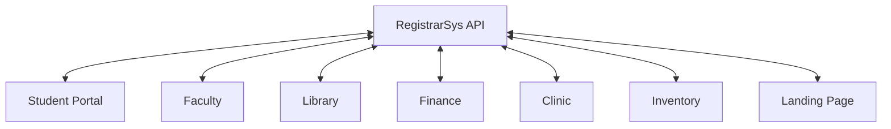

# RegistrarSys — Integration Plan

## 1. Overview

RegistrarSys is the Registrar module of the SIA College Management System.

It provides student information, academic programs, course details, enrollment information, and academic records through REST API endpoints.

For the midterm, RegistrarSys uses an independent Express.js mock API with in-memory data.

## 2. Module Information

| Property | Value |
|---|---|
| Module | RegistrarSys |
| Backend | Node.js / Express.js |
| Local Port | 3001 |
| API Base URL | http://localhost:3001/api/v1 |
| Swagger UI | http://localhost:3001/docs/ |
| Data Storage | In-memory mock data |
| API Format | JSON |
| Error Format | Problem Details JSON |

## 3. Integration Architecture

These connections are proposed integration relationships, not a claim that all modules are already connected.

## 4. Proposed Integration Agreements

| Module | Registrar Data Needed | Proposed Purpose |
|---|---|---|
| Student Portal | Student profile, enrollment status, academic records | Display student information and grades |
| Faculty | Students, courses, academic records | Verify students and course information |
| Finance | Student and enrollment information | Support assessment and payment workflows |
| Library | Student identification and status | Verify student eligibility |
| Clinic | Student identification | Match student profiles with clinic records |
| Inventory | Course or department-related information | Support possible supply requests |
| Landing Page | General program information | Display available academic programs |

All proposed data exchanges require agreement with the respective module teams.

## 5. Registrar API Endpoints

| Method | Endpoint | Purpose |
|---|---|---|
| GET | /api/v1/health | Check API availability |
| GET | /api/v1/programs | Retrieve programs |
| GET | /api/v1/students | Retrieve students |
| GET | /api/v1/students/{id} | Retrieve one student |
| POST | /api/v1/students | Create student |
| PUT | /api/v1/students/{id} | Update student